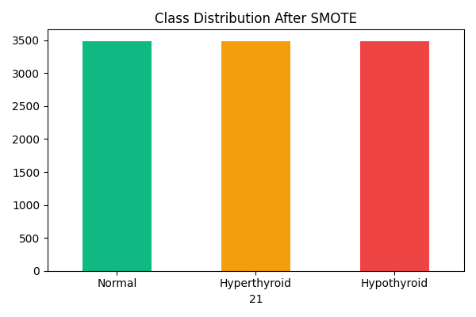
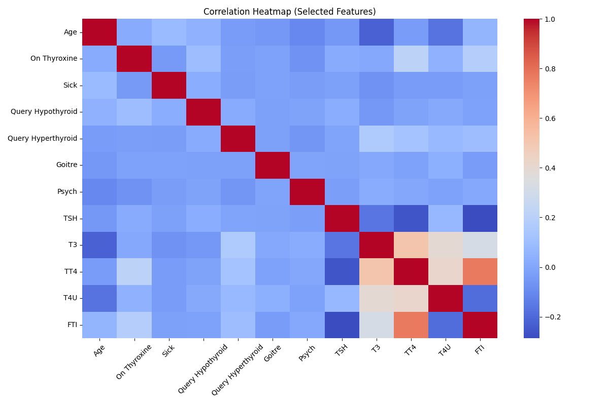
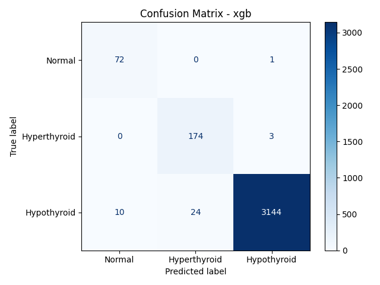
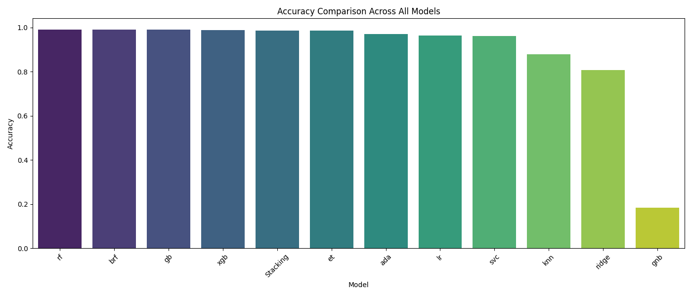
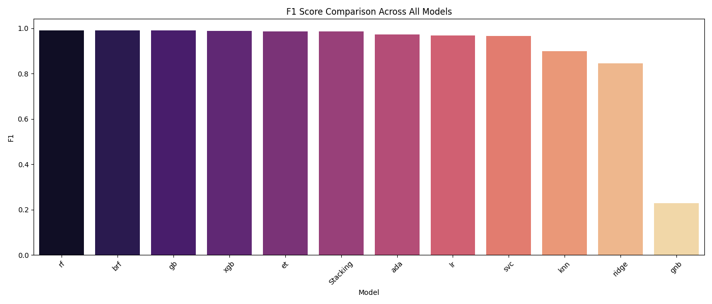
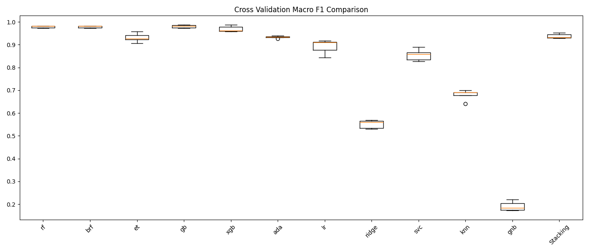
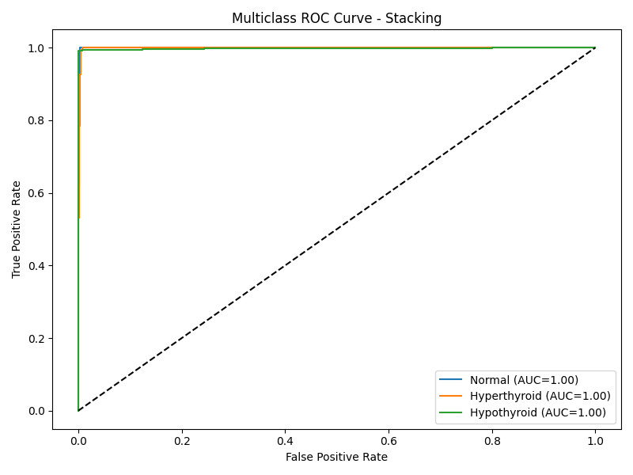
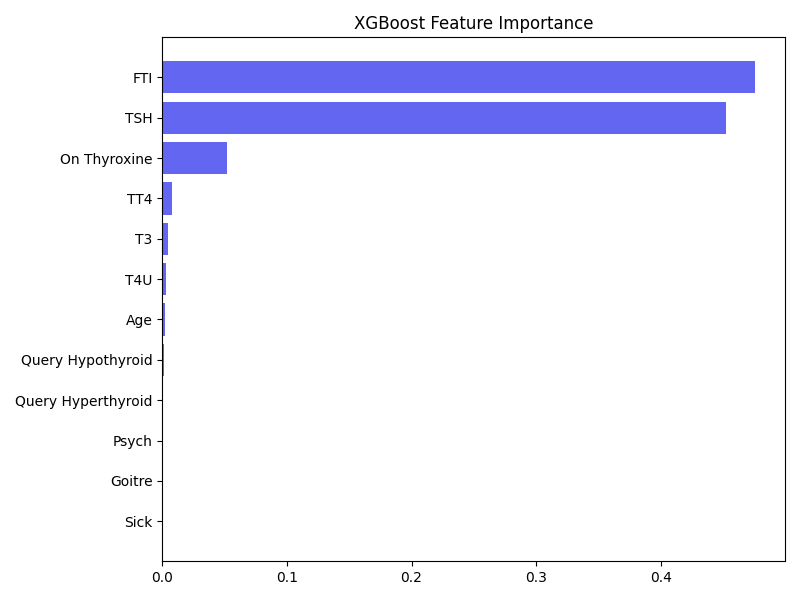
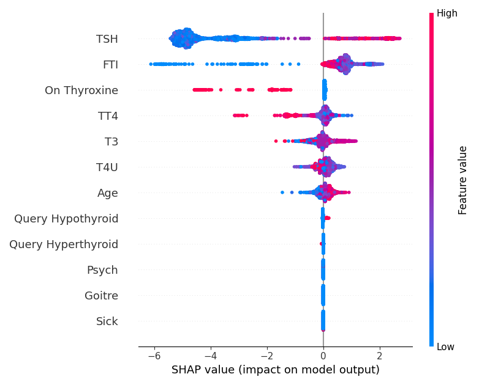

# 🧬 ThyroAI  
### Explainable Machine Learning System for Thyroid Disorder Classification

An end-to-end Machine Learning pipeline for automated thyroid disease diagnosis using ensemble learning and explainable AI (SHAP).

This project integrates:

- Data preprocessing pipeline
- Feature selection (Mutual Information)
- Class imbalance correction (SMOTE)
- 11 base machine learning models
- Stacking ensemble architecture
- Full comparative evaluation
- Explainability using SHAP
- FastAPI deployment
- Docker containerization

---

# 📌 Problem Statement

Thyroid disorders such as **Hyperthyroidism** and **Hypothyroidism** are prevalent endocrine diseases that require early detection for effective treatment.

This project builds a robust ensemble-based ML system that:

- Classifies patients into:
  - 🟢 Normal
  - 🟡 Hyperthyroid
  - 🔴 Hypothyroid
- Uses clinical and biochemical biomarkers
- Provides explainable predictions
- Compares multiple ML algorithms
- Produces publication-level evaluation visualizations

---

# 📊 Dataset

**Source:** UCI Thyroid Disease Dataset (ANN subset)

- Training file: `ann-train.data`
- Test file: `ann-test.data`
- Total features: 21
- Selected features (after selection): 12

---

## 🧪 Features Used

Clinical & biochemical attributes:

- Age
- Sex
- On Thyroxine
- Query Thyroxine
- On Antithyroid Medication
- Sick
- Pregnant
- Thyroid Surgery
- I131 Treatment
- Query Hypothyroid
- Query Hyperthyroid
- Lithium
- Goitre
- Tumor
- Hypopituitary
- Psych
- TSH
- T3
- TT4
- T4U
- FTI

---

# ⚙️ System Architecture

```
Raw Data
   ↓
Imputation (Median Strategy)
   ↓
Standard Scaling
   ↓
Feature Selection (Top 12 - Mutual Information)
   ↓
SMOTE (Class Balancing)
   ↓
11 Base Models
   ↓
Stacking Ensemble (Meta Logistic Regression)
   ↓
Evaluation + SHAP Explainability
   ↓
FastAPI Deployment
```

---

# 🤖 Models Implemented

## Base Models (11)

- Random Forest
- Balanced Random Forest
- Extra Trees
- Gradient Boosting
- XGBoost
- AdaBoost
- Logistic Regression
- Ridge Classifier
- Support Vector Machine (RBF Kernel)
- K-Nearest Neighbors
- Gaussian Naive Bayes

## Meta Model

- Logistic Regression (balanced)

---

# 📈 Evaluation Metrics

The system evaluates each model using:

- Accuracy
- Precision (Weighted)
- Recall (Weighted)
- F1 Score (Weighted & Macro)
- Confusion Matrix (per model)
- Multiclass ROC Curve
- 5-Fold Cross-Validation
- Feature Importance (XGBoost)
- SHAP Global Feature Importance

---

# 📊 Generated Evaluation Outputs

All plots are saved inside:

```
/outputs/
```

---

## 📉 Class Distribution

### Before SMOTE


### After SMOTE


---

## 🔍 Correlation Heatmap


---

## 📊 Confusion Matrices (All Models)

Examples:





*(Full set available in /outputs folder)*

---

## 📈 Accuracy Comparison


---

## 📈 F1 Score Comparison


---

## 📈 Cross-Validation Comparison


---

## 📈 Multiclass ROC Curve (Stacking)


---

## 🌳 XGBoost Feature Importance


---

## 🧠 SHAP Global Feature Importance


---

# 🧠 Explainability

SHAP is used to:

- Identify influential biomarkers
- Analyze feature contribution
- Improve clinical interpretability

Example interpretation:

> TSH and FTI show high contribution in differentiating hyperthyroid and hypothyroid cases.

This enhances transparency in clinical AI systems.

---

# 🚀 Running the Evaluation

### 1️⃣ Activate virtual environment

```bash
venv\Scripts\activate
```

### 2️⃣ Run evaluation

```bash
python paper_evaluation.py
```

All results will be saved inside `/outputs`.

---

# 🌐 FastAPI Deployment

Run locally:

```bash
uvicorn app.main:app --reload
```

Open in browser:

```
http://127.0.0.1:8000
```

### Available Endpoints

- `/predict`
- `/predict-batch`
- `/health`

---

# 🐳 Docker Support

### Build Docker Image

```bash
docker build -t thyroid-api .
```

### Run Container

```bash
docker run -p 8000:8000 thyroid-api
```

---

# 📂 Project Structure

```
ML42/
│
├── app/
│   ├── main.py
│   └── templates/
│
├── data/
│   ├── ann-train.data
│   └── ann-test.data
│
├── src/
│   ├── model.py
│   ├── preprocessing.py
│   ├── feature_selection.py
│   └── ...
│
├── outputs/
├── artifacts/
├── paper_evaluation.py
├── requirements.txt
└── Dockerfile
```

---

# 🏆 Key Contributions

- Large multi-model ensemble system
- Stacking meta-learner architecture
- Feature selection for dimensionality reduction
- SMOTE-based class balancing
- Comprehensive comparative evaluation
- SHAP-based explainable AI
- Production-ready REST API
- Dockerized deployment pipeline

---

# 📚 Technologies Used

- Python 3.11
- Scikit-learn
- XGBoost
- Imbalanced-learn
- SHAP
- Matplotlib
- Seaborn
- FastAPI
- Docker

---

# 🎓 Academic Relevance

Demonstrates:

- Advanced ensemble learning
- Multiclass evaluation methodology
- Explainable AI in healthcare
- End-to-end ML pipeline design
- Model comparison and validation

Suitable for:

- Final Year Major Project
- ML Coursework
- Research Demonstration
- Clinical AI Prototype

---

# ⚠️ Disclaimer

This system is intended for educational and research purposes only.  
It is not a substitute for professional medical diagnosis.

---

# 👨‍💻 Author

**Mohammed Mateen**  
Machine Learning & Data Science Enthusiast  
Hyderabad, India